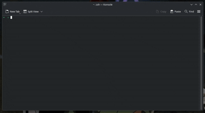

# Migurdex

<p align="center">
  
</p>

[](https://github.com/roxyrekt/Migurdex/actions)
[](https://github.com/roxyrekt/Migurdex/releases)
[](LICENSE)

Farklı kaynaklardan anime arayıp terminal üzerinden izlemeyi sağlayan modüler araç. Klavye odaklı bir terminal arayüzü (TUI), sağlayıcı plugin'leriyle konuşan bir HTTP API ve Rust ile yazılmış bir ağ katmanından oluşur; oynatma MPV üzerinden yapılır.

## Demo



## Özellikler

- **Fuzzy arama** — harf atlamalı, skorlu sıralama (`opc` → One Piece).
- **12 Türkçe anime sağlayıcısı** — plugin mimarisi; yetenekler override edilen metotlardan otomatik çıkar.
- **Metadata** — AniList ve MAL üzerinden bilgi çekme.
- **Otomatik kaynak seçimi** — sunucu / kalite / tür boyutlarında `Otomatik` / `Asla` / `Sadece` kuralları; uygun kaynak yoksa manuel listeye düşer.
- **Sıralama öncelikleri** — kategori, çözünürlük, format ve sunucu tercih sıraları.
- **İzleme geçmişi ve favoriler** — tek tuşla devam etme, yönetim ekranları, arama geçmişi yönetimi.
- **MPV entegrasyonu** — kaldığın yerden devam, ilerleme takibi.
- **Discord Rich Presence** ve **gizli mod**.
- Kesilebilir bildirimler, `Esc` ile tutarlı geri navigasyon.

## Gereksinimler

| Ne | Neden |
|---|---|
| [MPV Player](https://mpv.io/) (PATH'te) | Video oynatma |
| .NET 10 SDK | Kaynaktan derlemek için |
| Rust / cargo | Native ağ katmanını derlemek için |
| `libfuse2` (Linux) | AppImage'i çalıştırmak için |

## Hızlı başlangıç

Hazır sürümleri [Releases](https://github.com/roxyrekt/Migurdex/releases) sayfasından indirin.

**Arşiv (Linux/macOS/Windows):** `tar.gz` / `zip` dosyasını açın, içindeki `migurdex` (veya `migurdex.exe`) dosyasını çalıştırın — API arka planda otomatik başlar.

**AppImage (Linux):**

```bash
chmod +x Migurdex-x86_64.AppImage
./Migurdex-x86_64.AppImage
```

## Kaynaktan derleme

```bash
# Debug dev-loop (Linux/macOS)
./build.sh
# Windows
.\build.ps1

# Release dev-loop
./build.sh --release
.\build.ps1 -Release

# Dağıtım paketi (dist/ altına arşiv)
./build.sh --publish
.\build.ps1 -Publish
```

Ardından iki ayrı terminalde:

```bash
# 1. API servisi
dotnet run --project Migurdex.Api

# 2. Terminal istemcisi
dotnet run --project Migurdex.Cli
```

## Kullanım

Akış: **Arama → Detay → Bölüm → Kaynak → Oynat**.

1. **Arama:** Ana menüden aramaya girin, anime adını yazın (fuzzy eşleşme daraltır).
2. **Detay:** Sonuçtan seçince açıklama, türler ve bölüm listesi gelir.
3. **Bölüm:** Bölümü seçince fansub grupları listelenir.
4. **Kaynak:** Grubu seçince çözülen kaynaklar (sunucu / kalite / tür) gelir.
5. **Oynat:** Kaynağı seçince MPV açılır; kaldığınız yer kaydedilir.

**Otomatik seçim kuralları:** Ayarlar → `Otomatik: Sunucular / Kaliteler / Türler` ekranlarında her öğe `Otomatik → Asla → Sadece` arasında döner.

- `Otomatik`: kural yok, seçilebilir.
- `Asla`: otomatik seçimde elenir (manuel listede görünür).
- `Sadece`: liste doluysa yalnız işaretliler otomatik seçilir.

**Geçmiş ve favoriler:** İzleme geçmişinden tek tuşla devam edilir; favoriler, arama geçmişi ve izleme kayıtları ilgili yönetim ekranlarından silinir/temizlenir.

## Yapılandırma

Ayarlar ekranında: `Otomatik Oynat`, `Bekleme Süresi`, `Sıralama Öncelikleri...` (kategori / çözünürlük / format / sunucu sıraları + otomatik kural ekranları), `Sağlayıcı Yönetimi...`, Discord RPC, gizli mod, API adresi.

Tüm veriler `~/.config/migurdex/` altında tutulur (`config.json`, `history.json`, `search_history.json`, `favorites.json`). API logları `~/.config/migurdex/logs/api.log` dosyasına yazar.

## Mimari

| Proje | Rol |
|---|---|
| `Migurdex.Api` | HTTP API: arama, detay, kaynak çözümleme, sağlık (`/health`) |
| `Migurdex.Cli` | Klavye odaklı terminal arayüzü (Spectre.Console) |
| `Migurdex.Core` | Ortak servisler: plugin yükleyici, Rust köprüsü (`RustBridge`), HTTP işleyici |
| `Migurdex.Shared` | Modeller + arayüzler (`IAnimeProvider`, `IExtractor`, ...) |
| `Migurdex.Native` | Rust ağ katmanı (`cdylib`): HTTP istemcisi, emülasyon, hız limiti |
| `Plugins/` | Sağlayıcı plugin'leri (`Migurdex.Plugins.*`) |

İstek akışı: `TUI → API → plugin (+ Rust HTTP) → kaynak listesi → MPV`. Native kütüphane (`libmigurdex_native.so` / `migurdex_native.dll`) API çıktısının yanına kopyalanır ve başlangıçta oradan yüklenir; yoksa API `rust: false` ile çalışmaya devam eder.

## Plugin geliştirme

1. `Migurdex.Shared` içindeki `IAnimeProvider` arayüzünü implemente edin (`SearchAsync`, `GetDetailsAsync`, `GetGroupsAsync`, `GetVideoSourcesAsync` — ihtiyacınız olanları override etmeniz yeterli, yetenekler otomatik çıkar).
2. Projeyi `Plugins/Migurdex.Plugins.<Ad>/` altına koyun (dizin adı = proje adı).
3. `./build.sh` çalıştırın — build scripti yeni plugini otomatik keşfedip API'nin `Plugins` klasörüne kopyalar; API başlangıçta klasördeki tüm pluginleri yükler.

## Yol haritası

- [ ] **MyAnimeList & AniList izleme durumu eşitleme**
- [ ] **Otomatik yeni bölüm takibi**
- [ ] **Intro skip** (aniskip benzeri)

---

GPL-3.0 Lisansı. Detaylar için [LICENSE](LICENSE) dosyasına bakın.
