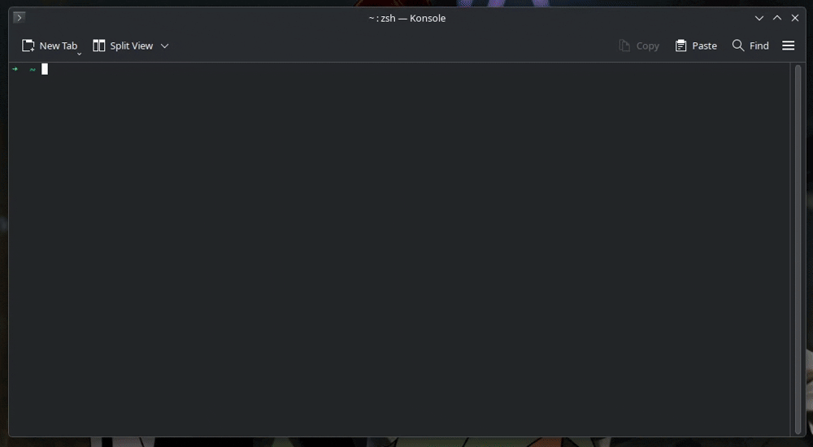

# Migurdex

<p align="center">
  
</p>

<p align="center">
  <a href="https://github.com/roxyrekt/Migurdex/actions"></a>
  <a href="https://github.com/roxyrekt/Migurdex/releases"></a>
  <a href="LICENSE"></a>
  
  
</p>

Terminalden Türkçe anime aramak ve izlemek için araç. TUI + yerel HTTP API + Rust ağ katmanı, oynatma MPV ile.

*Watch anime from your terminal: search across Turkish providers and play episodes via MPV.*



## Özellikler

- Fuzzy arama (`opc` -> One Piece gibi)
- 13 Türkçe sağlayıcı: Acheriya, AniHub, AnimeciX, Animexe, AnimPow, Anizium, Anizm, AsyaAnimeleri, OpenAnime, SonAnime,
  TrAnimeIzle, TRAnimeci, TurkAnime (Arşiv)
- AniList ve MAL ile bilgi/poster çekme ve izleme durumu eşitleme
- MPV ile kaldığın yerden devam etme
- Geçmiş, favoriler, arama geçmişi
- Discord RPC (ayarlanabilir)
- Otomatik kaynak seçimi (sunucu / kalite / tür kuralları, uymazsa manuel liste)
- Gizli mod (geçmiş ve senkronu duraklatır)
- Sağlayıcı açma/kapama ve sıralama öncelikleri

## Kurulum

**Linux:**

```bash
curl -fsSL https://raw.githubusercontent.com/roxyrekt/Migurdex/main/install.sh | bash
```

**Windows (PowerShell):**

```powershell
irm https://raw.githubusercontent.com/roxyrekt/Migurdex/main/install.ps1 | iex
```

Sonra `migurdex` yazıp çalıştır. API arka planda kendisi başlıyor.

Kaldırmak için:

```bash
# Linux, ayarları tutar
curl -fsSL https://raw.githubusercontent.com/roxyrekt/Migurdex/main/install.sh | bash -s -- --uninstall

# Linux, her şeyi siler
curl -fsSL https://raw.githubusercontent.com/roxyrekt/Migurdex/main/install.sh | bash -s -- --purge
```

```powershell
# Windows, ayarları tutar
irm https://raw.githubusercontent.com/roxyrekt/Migurdex/main/install.ps1 | % { & ([scriptblock]::Create($_)) -Uninstall }

# Windows, her şeyi siler
irm https://raw.githubusercontent.com/roxyrekt/Migurdex/main/install.ps1 | % { & ([scriptblock]::Create($_)) -Purge }
```

Manuel kurmak istersen [Releases](https://github.com/roxyrekt/Migurdex/releases) sayfasından `tar.gz` / `zip` /
`AppImage` indirip çalıştırman yeterli.

```bash
chmod +x Migurdex-x86_64.AppImage
./Migurdex-x86_64.AppImage
```

## Gereksinimler

- [MPV](https://mpv.io/) kurulu ve PATH'te olmalı
- AppImage için Linux'ta `libfuse2`
- Kaynaktan derlemek için: .NET 10 SDK + Rust / cargo

## Kullanım

Akış basit: Arama -> Detay -> Kaynak -> Oynat.

1. Ana menüden aramaya gir, adı yaz (liste fuzzy daralır).
2. Sonuçtan seçince açıklama ve bölüm listesi gelir.
3. Bölümü seçince fansub grupları ve kaynaklar (sunucu / kalite / tür) gelir.
4. Kaynağı seçince MPV açılır.

`Esc` bir önceki ekrana döner. Yön tuşları + `Enter` ile kullanılıyor.

### Komut satırı modu (non-interactive)

Menüye girmeden doğrudan arama/oynatma:

```bash
migurdex search "one piece"                  # sağlayıcı | başlık | id listeler
migurdex search "naruto" -p TurkAnime --json # JSON çıktı
migurdex play "one piece" -e 12              # 12. bölümü oynat
migurdex play "naruto" -s 2 -p TurkAnime -g FansubAdı
migurdex play "bleach" --debug               # mpv açmadan çözülen URL'yi yazdır
migurdex continue                            # kaldığın yerden devam et
```

`-e` verilmezse kaldığın bölümden (yoksa 1. bölümden) başlar. Kaynak seçimi ayarlardaki otomatik seçim kurallarıyla
aynıdır.

### Güncelleme

Açılışta yeni sürüm varsa sorulur (`Evet / Hayır / Bu sürümü atla`). Elle kontrol ve kurulum:

```bash
migurdex update                                    # yeni sürüm varsa onaylı kurar ve otomatik yeniden başlatır
migurdex update --no-restart                       # kurar ama yeniden başlatmaz
migurdex update --check                            # sadece kontrol eder
migurdex update --channel prerelease               # bu seferlik pre-release kanalından bakar
migurdex --version                                 # kurulu sürüm
```

Kanal ve otomatik kontrol Ayarlar menüsünden değiştirilir (Güncelleme Kontrolü / Güncelleme Kanalı). Kontrolü bir
seferlik atlamak için `migurdex --no-update-check` ile başlat. Güncelleme `~/.config/migurdex/` altındaki ayar ve
geçmişe dokunmaz.

## Ayarlar

Ayarlar menüsünden değiştirilebilenler: otomatik oynat, bekleme süresi, Discord RPC ve başlık modu, gizli mod, oynatıcı
logları, API adresi (varsayılan `http://127.0.0.1:7045`), AniList / MAL bağlantısı, sağlayıcı açma-kapama, sıralama
öncelikleri ve otomatik seçim kuralları (Otomatik / Asla / Sadece).

Kaydetmeden çıkarsan (`Esc` / İptal) değişiklikler uygulanmaz.

## Dosyalar

Linux'ta `~/.config/migurdex/` altında tutulur:

`migurdex.db` (SQLite veritabanı: geçmiş, favoriler, arama, tokenlar, eşleştirmeler), `config.json`, loglar
`logs/api.log` içinde.

Windows'ta `%APPDATA%\migurdex\` altında aynı yapı var.

## Mimari

| Proje             | Ne yapar                                               |
|-------------------|--------------------------------------------------------|
| `Migurdex.Api`    | Arama, detay, kaynak çözümleme                         |
| `Migurdex.Cli`    | Terminal arayüzü                                       |
| `Migurdex.Core`   | Plugin yükleyici, Rust köprüsü, extractor'lar          |
| `Migurdex.Shared` | Modeller ve arayüzler (`IAnimeProvider`, `IExtractor`) |
| `Migurdex.Native` | Rust tarafı HTTP istemcisi                             |
| `Plugins/`        | Sağlayıcılar (`Migurdex.Plugins.*`)                    |

Akış: `TUI -> API -> plugin (+ Rust HTTP) -> kaynak listesi -> MPV`. Native kütüphane (`libmigurdex_native.so` /
`migurdex_native.dll`) API ile birlikte gelir, eksikse API başlamaz.

Bulit-in extractor'lar `Migurdex.Core/Extractors` altında. API tarafında `GET /api/v1/extractors` ve
`POST /api/v1/extractors/resolve` ile de çağrılabiliyor.

TurkAnime sağlayıcısı, kapanan sitenin arşivinin temizlenip doğrulanmış halini kullanır (ölü kayıtlar atıldı, başlıklar
onarıldı, AniList/MAL eşleştirmeleri eklendi; canlı Turso veritabanı üzerinden sorgulanır). Ham SQLite dosyası:
[mdexturkanime/turkanime-db](https://huggingface.co/datasets/mdexturkanime/turkanime-db/blob/main/turkanime-v1.db).

## Derleme

```bash
# Linux
./build.sh            # debug
./build.sh --release
./build.sh --publish  # dist/ altına paket

# Windows
.\build.ps1
.\build.ps1 -Release
.\build.ps1 -Publish
```

Geliştirirken iki terminalde:

```bash
dotnet run --project Migurdex.Api
dotnet run --project Migurdex.Cli
```

Testler:

```bash
dotnet test
```

## Yol Haritası

- [x] MAL ve AniList senkronu
- [ ] Yeni bölüm atlama
- [ ] Intro skip

---

GPL-3.0. Detay için [LICENSE](LICENSE) dosyasına bak.
