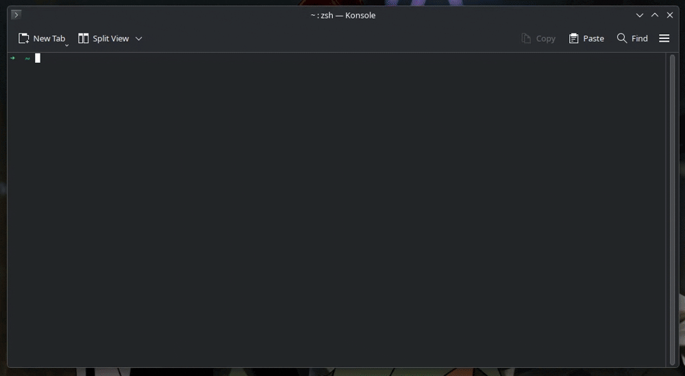

# Migurdex

<p align="center">
  
</p>

<p align="center">
  <a href="https://github.com/roxyrekt/Migurdex/actions"></a>
  <a href="https://github.com/roxyrekt/Migurdex/releases"></a>
  <a href="LICENSE"></a>
  
  
</p>

Terminalden Türkçe anime aramak ve izlemek için araç. TUI + yerel HTTP API + Rust ağ katmanı, oynatma MPV ile.

*Watch anime from your terminal: search across Turkish providers and play episodes via MPV.*



## Belgeler (start here)

- **[`API.md`](API.md)** — Migurdex'in kendi yerel REST API'sinin tam referansı. Tüm uçlar
  (`/health`, `/api/v1/anime/*`, `/api/v1/metadata/*`, `/api/v1/extractors/*`, `/api/v1/tracker/*`),
  SSE akış protokolü, veri modelleri, enum karşılıkları, hata biçimleri, SSRF koruması ve canlı
  doğrulama kaydı. **Harici istemci yazacaksan buradan başla.**
- **[`DOWNLOAD.md`](DOWNLOAD.md)** — indirme özelliğinin tam dokümantasyonu. **İndirme özelliğini öğrenmek
  için buradan başla:** genel akış, CLI bayrakları, çıkış kodları, JSON çıktısı, `config.json` alanları,
  test kapsamı ve `Bilinen sınırlar ve riskler`.
- [`DEVELOPMENT_LOG.md`](DEVELOPMENT_LOG.md) — indirme özelliğinin başlangıçtan upstream'e
  merge edilene kadar kronolojik geliştirme günlüğü.
- [`PR_DESCRIPTION.md`](PR_DESCRIPTION.md) — fork ve upstream hedefi için PR metinleri.
- [`docs/verification/`](docs/verification/README.md) — düzeltmelerin **ölçüm
  kayıtları**: her iddia için ne ölçüldü, nasıl ölçüldü ve *düzeltme olmasaydı ne
  olurdu*. Kontrol deneyleri, Linux doğrulama turları ve 46 ders bu klasörde.

## Özellikler

- Fuzzy arama (`opc` -> One Piece gibi)
- 14 Türkçe sağlayıcı: Acheriya, AniHub, AnimeciX, Animexe, AnimPow, Anizium, Anizm, AsyaAnimeleri, Deokwave, OpenAnime, SonAnime,
  TrAnimeIzle, TRAnimeci, TurkAnime (Arşiv)
- AniList ve MAL ile bilgi/poster çekme ve izleme durumu eşitleme
- MPV ile kaldığın yerden devam etme
- API'den gelen doğrudan MP4/HLS kaynaklarını komut satırından veya TUI'den indirme
- Geçmiş, favoriler, arama geçmişi
- Discord RPC (ayarlanabilir)
- Otomatik kaynak seçimi (sunucu / kalite / tür kuralları, uymazsa manuel liste)
- Gizli mod (geçmiş ve senkronu duraklatır)
- Sağlayıcı açma/kapama ve sıralama öncelikleri

## Kurulum

**Linux:**

```bash
curl -fsSL https://raw.githubusercontent.com/roxyrekt/Migurdex/main/install.sh | bash
```

**Windows (PowerShell):**

```powershell
irm https://raw.githubusercontent.com/roxyrekt/Migurdex/main/install.ps1 | iex
```

Sonra `migurdex` yazıp çalıştır. API arka planda kendisi başlıyor.

Kaldırmak için:

```bash
# Linux, ayarları tutar
curl -fsSL https://raw.githubusercontent.com/roxyrekt/Migurdex/main/install.sh | bash -s -- --uninstall

# Linux, her şeyi siler
curl -fsSL https://raw.githubusercontent.com/roxyrekt/Migurdex/main/install.sh | bash -s -- --purge
```

```powershell
# Windows, ayarları tutar
irm https://raw.githubusercontent.com/roxyrekt/Migurdex/main/install.ps1 | % { & ([scriptblock]::Create($_)) -Uninstall }

# Windows, her şeyi siler
irm https://raw.githubusercontent.com/roxyrekt/Migurdex/main/install.ps1 | % { & ([scriptblock]::Create($_)) -Purge }
```

Manuel kurmak istersen [Releases](https://github.com/roxyrekt/Migurdex/releases) sayfasından paketi indirip
çalıştırman yeterli. CI her tag'de platform başına şu dosyaları üretir:

| Platform | Dosyalar |
|---|---|
| Linux x86_64 | `migurdex-linux-x64.tar.gz`, `migurdex-x86_64.AppImage`, `migurdex-x86_64.AppImage.zsync` |
| Linux aarch64 | `migurdex-linux-arm64.tar.gz`, `migurdex-aarch64.AppImage`, `migurdex-aarch64.AppImage.zsync` |
| Windows x64 | `migurdex-win-x64.zip` |

Her platform için ayrıca `sha256sums-linux-x64.txt`, `sha256sums-linux-arm64.txt` ve
`sha256sums-win-x64.txt` özet dosyaları yayınlanır. Linux'ta AppImage'yi çalıştırmak için:

```bash
chmod +x migurdex-x86_64.AppImage        # aarch64'te: migurdex-aarch64.AppImage
./migurdex-x86_64.AppImage
```

AppImage için Linux'ta `libfuse2` gerekir (bkz. [Gereksinimler](#gereksinimler)).

## Gereksinimler

- [MPV](https://mpv.io/) kurulu ve PATH'te olmalı
- HLS (`.m3u8`) indirmek için [yt-dlp](https://github.com/yt-dlp/yt-dlp) kurulu olmalı; segmentleri birleştirmek/aktarmak için
  yt-dlp'nin kullanabildiği [ffmpeg](https://ffmpeg.org/) de gerekebilir. MP4 indirme bu araçlara ihtiyaç duymaz.
  8 MiB üstü MP4'ler sunucu Range destekliyorsa 2-4 paralel parçayla iner, desteklemiyorsa sıralıya düşer.
- HLS indirme ilerlemesi yt-dlp'nin ürettiği progress satırlarından okunur; Migurdex yt-dlp'ye daima `--progress` verir
  (yt-dlp'de `--print` bayrağı bu çıktıyı kapattığından).
- Migurdex yt-dlp veya ffmpeg'i otomatik indirmez/kurmaz.
- AppImage için Linux'ta `libfuse2`
- Kaynaktan derlemek için: .NET 10 SDK + Rust / cargo

## Kullanım

Akış basit: Arama -> Detay -> Bölüm -> Kaynaklar -> Oynat / İndir.

1. Ana menüden aramaya gir, adı yaz (liste fuzzy daralır).
2. Sonuçtan seçince açıklama ve bölüm listesi gelir.
3. Bölümü seçince fansub grupları ve kaynaklar (sunucu / kalite / tür) taranır.
4. Kaynağı seçince `Oynat`, `İndir` veya `Geri` seçilir. Otomatik kaynak seçimi açıksa en iyi kaynak
   doğrudan oynatılır/indirilir.

`Esc` bir önceki ekrana döner. Yön tuşları + `Enter` ile kullanılıyor. İndirme sırasında `Esc` indirmeyi iptal eder;
indirme MPV'yi açmaz ve izleme geçmişi/tracker senkronunu tetiklemez.

### Komut satırı modu (non-interactive)

Menüye girmeden doğrudan arama/oynatma/indirme:

```bash
migurdex search "one piece"                  # sağlayıcı | başlık | id listeler
migurdex search "naruto" -p TurkAnime --json # JSON çıktı
migurdex play "one piece" -e 12              # 12. bölümü oynat
migurdex play "naruto" -s 2 -p TurkAnime -g FansubAdı
migurdex play "bleach" --debug               # mpv açmadan çözülen URL'yi yazdır
migurdex continue                            # kaldığın yerden devam et

migurdex download "one piece" -e 12
migurdex download "naruto" -s 2 -p TurkAnime -g FansubAdı -o ~/Videos/Anime
migurdex download "bleach" -e 1 --format mp4 --no-subs
migurdex download "bleach" -e 1 --format hls --force --no-resume
migurdex download "bleach" -e 1 --json       # stdout yalnız JSON, ilerleme stderr'de
```

`download` akışı Search -> Details -> Episode -> Group/Source sırasını izler. Yalnız API'nin çözdüğü doğrudan `MP4` ve
`M3U8/HLS` kaynakları kullanılır; `Embed` ve `Unknown` kaynaklar indirilmez. `-p`/`-g` verildiğinde seçimler doğrulanır.
Bölüm verilmezse izleme geçmişine bakılmaz; sezon filtreli deterministik ilk bölüm seçilir. `auto`, mevcut kalite/biçim
tercihleri ve `SourceSelector` kurallarına uyar, en iyi üç uygun adayı sırayla dener. `--force` var olan hedefi değiştirir,
`--no-resume` kısmi MP4 dosyasından devam etmez. Çıkış kodları:

| Kod | Anlam |
|---:|---|
| `0` | Başarı |
| `1` | Çalışma zamanı / upstream (sağlayıcı) hatası |
| `2` | Kullanım (usage) hatası |
| `3` | Video tamamlandı, altyazı aşaması kullanıcı tarafından iptal edildi |

`--debug` URL, header veya token yazdırmaz; indirmeyi başlatmadan yalnız güvenli kaynak özetini gösterir.
`--json` modunda stdout yalnız JSON, ilerleme ve uyarılar stderr'e gider.

Varsayılan çıktı kökü platformun Downloads klasöründe `Migurdex` altıdır (`-o` ile değiştirilebilir). Dosyalar
`<çıktı>/<anime>/SxxEyy - <bölüm>.<uzantı>` düzeninde yazılır. Altyazılar medyanın yanına ayrı `.srt`, `.ass` veya
`.vtt` sidecar dosyaları olarak kaydedilir. HLS'de gerçek medya uzantısı yt-dlp'nin ürettiği çıktıya göre korunur.

### Güncelleme

Açılışta yeni sürüm varsa sorulur (`Evet / Hayır / Bu sürümü atla`). Elle kontrol ve kurulum:

```bash
migurdex update                                    # yeni sürüm varsa onaylı kurar ve otomatik yeniden başlatır
migurdex update --no-restart                       # kurar ama yeniden başlatmaz
migurdex update --check                            # sadece kontrol eder
migurdex update --channel prerelease               # bu seferlik pre-release kanalından bakar
migurdex --version                                 # kurulu sürüm
```

Kanal ve otomatik kontrol Ayarlar menüsünden değiştirilir (Güncelleme Kontrolü / Güncelleme Kanalı). Kontrolü bir
seferlik atlamak için `migurdex --no-update-check` ile başlat. Güncelleme `~/.config/migurdex/` altındaki ayar ve
geçmişe dokunmaz.

## Ayarlar

Ayarlar menüsünden değiştirilebilenler: otomatik oynat, bekleme süresi, Discord RPC ve başlık modu, gizli mod, oynatıcı
logları, API adresi (varsayılan `http://127.0.0.1:7045`), AniList / MAL bağlantısı, sağlayıcı açma-kapama, sıralama
öncelikleri ve otomatik seçim kuralları (Otomatik / Asla / Sadece).

Kaydetmeden çıkarsan (`Esc` / İptal) değişiklikler uygulanmaz.

İndirme varsayılanları `config.json` içinden de değiştirilebilir: `DownloadDirectory`, `YtDlpPath`, `DownloadSubtitles`,
`DownloadResume` ve `DownloadOverwrite`. Sırasıyla platform Downloads/Migurdex dizini, `yt-dlp`, `true`, `true` ve `false`
varsayılanları kullanılır. `AutoDownloadBestSource` (`false`) kapalıyken bölümden İndir kaynak seçim ekranını açar;
açıkken en iyi aday otomatik indirilir. `DownloadAutoSelectTimeoutSeconds` (`60`) indirme öncesi
**kaynak taramasının** bütçesidir (tek API çağrısına duvar-saati sınırı); tutamazsa manuel listeye düşülür.
Bu, TUI'deki `AutoSelectTimeoutSeconds` (`5`, kaynak listesinde otomatik seçim beklemesi) ile
**farklı bir ayardır** ve biri değişince diğeri değişmez. Eski config dosyaları yeni alanlar eklenmeden de
güvenle yüklenir. Migurdex bu harici araçları otomatik indirmez.

## Güvenlik ve kaynak kullanımı

İndirme yalnız API'nin sağladığı doğrudan medya URL'lerini kullanır; gömülü oynatıcı sayfalarını veya `Unknown` kaynakları
otomatik olarak indirmez. Yalnız HTTP/HTTPS kaynakları kullanılır ve farklı origin'e yönlendirmede
`Authorization`/`Cookie` gibi hassas başlıklar düşürülür. Yalnız erişimine ve indirmesine izin verdiğiniz içerikleri
kaydedin; DRM/paywall korumasını aşmaya çalışan kaynakları indirmeyin. `--debug` çıktısı güvenlik için URL, header ve token
içermez.

## Bilinen sınırlar

- **HLS için harici araçlar gerekir.** `.m3u8` kaynaklarda [yt-dlp](https://github.com/yt-dlp/yt-dlp) zorunludur;
  segmentleri birleştirmek/aktarmak için çoğu durumda [ffmpeg](https://ffmpeg.org/) de gerekir. Migurdex bu
  araçları otomatik indirmez/kurmaz. `MP4` indirme bu araçlara ihtiyaç duymaz.
- **MP4 resume imzalı kaynaklarda çalışmıyor.** Resume parçası, kaynak URL'inin normalize edilmiş
  SHA-256 özetiyle adlandırılır. Google Drive ve googlevideo gibi sağlayıcılar her çözümlemede URL'i
  yeniden imzaladığı için özet değişir; kısmi indirme bulunamaz ve silinmedikçe diskte birikir.
  Ölçüm: aynı dosyada 6 koşu → 6 farklı özet, ~100 MB orphan. Düzeltme bu depoda
  [`b3fc2c7`](https://github.com/Nutaliaxd/Migurdex/pull/4) commit'iyle.
- **HLS'de resume yoktur.** MP4'te `.part` + `.meta` ile kaldığı yerden devam edilir; HLS'de yt-dlp her
  denemeyi geçici iş dizininde baştan yapar. `--no-resume` yalnız MP4'ü etkiler.
- **Altyazı mux edilmez.** Altyazılar videonun yanına ayrı `.srt` / `.ass` / `.vtt` **sidecar** dosyası olarak
  iner; videoya gömülmez. Altyazının oynatılması için oynatıcının sidecar'ı otomatik bulması gerekir.
- **Deokwave sağlayıcısı boş sonuç verebilir.** `deokwave.com` Cloudflare `"Just a moment..."` JS
  challenge'iyle HTTP 403 döndürür. Upstream bu sağlayıcı için Turnstile solver üzerinde çalışıyor.
- **İndirme, izleme kaydı üretmez.** İndirme MPV açmaz, izleme geçmişine yazmaz ve AniList/MAL tracker
  senkronunu tetiklemez.
- **CLI tek bölüm indirir.** `migurdex download -e <n>` tek bölüm alır; `-s/--season` bir **filtre**,
  "sezonun tamamını indir" değildir. Kaynak seçimi yalnız TUI'de vardır.

### Bu depoda giderilmiş sınırlar

Aşağıdakiler önceki sürümlerde sınırdı, **bu depoda düzeltildi**; ayrıntı için
[`DOWNLOAD.md`](DOWNLOAD.md) ve `DEVELOPMENT_LOG.md`:

- **MP4 resume imzalı kaynaklarda çalışmıyordu.** Parça adı artık URL'in tamamından değil, kaynağı
  *kimliklendiren* sorgu parametrelerinden (`id`, `vid`, `slug`…) üretiliyor; her istekte değişen
  imza/ölçüm parametreleri (`expire`, `signature`, `token`) hariç tutuluyor. Aynı bölüm artık aynı
  `.part` dosyasını kullanıyor. Sürümden önce kalan parçalar ve farklı adayların bıraktıkları en yeni
  2 grup korunuyor, fazlası atılıyor.
- **HLS'de graceful olmayan sonlandırma diski kirletiyordu.** İş dizini artık sistem geçici
  klasöründe; zorla öldürülen indirmelerden sonra **kullanıcı klasöründe 0 bayt** kalıyor
  (ölçüm: `taskkill /F` ile önce 130.022.831 bayt). 6 saatten eski iş dizinleri başlangıçta temizleniyor.
- **CLI'da ağ geçidi (SSRF) koruması yoktu.** Koruma `Migurdex.Shared/NetworkGuard` içine taşındı;
  API ve CLI artık **tek uygulamayı** kullanıyor. Yönlendirme hedefleri de korumadan geçiyor.

Kapsamlı sınır listesi ve riskler için [`DOWNLOAD.md`](DOWNLOAD.md) → `Bilinen sınırlar ve riskler`
bölümüne bak.

## Dosyalar

Linux'ta `~/.config/migurdex/` altında tutulur:

`migurdex.db` (SQLite veritabanı: geçmiş, favoriler, arama, tokenlar, eşleştirmeler), `config.json`, loglar
`logs/api.log` içinde.

Windows'ta `%APPDATA%\migurdex\` altında aynı yapı var.

## Mimari

| Proje             | Ne yapar                                               |
|-------------------|--------------------------------------------------------|
| `Migurdex.Api`    | Arama, detay, kaynak çözümleme                         |
| `Migurdex.Cli`    | Terminal arayüzü                                       |
| `Migurdex.Core`   | Plugin yükleyici, Rust köprüsü, extractor'lar          |
| `Migurdex.Shared` | Modeller ve arayüzler (`IAnimeProvider`, `IExtractor`) |
| `Migurdex.Native` | Rust tarafı HTTP istemcisi                             |
| `Plugins/`        | Sağlayıcılar (`Migurdex.Plugins.*`)                    |

Akış: `TUI/CLI -> API -> plugin (+ Rust HTTP) -> kaynak listesi -> MPV veya indirici`. Native kütüphane
(`libmigurdex_native.so` /
`migurdex_native.dll`) API ile birlikte gelir, eksikse API başlamaz.

Built-in extractor'lar `Migurdex.Core/Extractors` altında. API tarafında `GET /api/v1/extractors` ve
`POST /api/v1/extractors/resolve` ile de çağrılabiliyor. Tüm HTTP uçlarının, SSE protokolünün ve veri
modellerinin referansı için [`API.md`](API.md).

TurkAnime sağlayıcısı, kapanan sitenin arşivinin temizlenip doğrulanmış halini kullanır (ölü kayıtlar atıldı, başlıklar
onarıldı, AniList/MAL eşleştirmeleri eklendi; canlı Turso veritabanı üzerinden sorgulanır). Ham SQLite dosyası:
[roxyrekt/turkanime-db](https://huggingface.co/datasets/roxyrekt/turkanime-db/blob/main/turkanime-v1.db).

## Derleme

```bash
# Linux
./build.sh            # debug
./build.sh --release
./build.sh --publish  # dist/ altına paket

# Windows
.\build.ps1
.\build.ps1 -Release
.\build.ps1 -Publish
```

Geliştirirken iki terminalde:

```bash
dotnet run --project Migurdex.Api
dotnet run --project Migurdex.Cli
```

Testler:

```bash
dotnet test
```

Release paketlerini CI, [Kurulum → manuel kurulum](#kurulum) tablosundaki dosya adlarıyla üretir.

### Doğrulama kaydı

**v1.11.0 hizalama (30 Eylül 2026):** upstream `b690399` bu fork'un `main` dalına birleştirildi
(19 çatışma; kodda upstream kazanmış, `SourceExtractionReport` ve dört doküman korunmuş).
Release derlemesi **0 uyarı / 0 hata**; ağ bağımlı `ExtractorSmokeTests` hariç **333/333** test
geçti (upstream'in 328'i + 5 `SourceExtractionReport` testi).

MP4 resume düzeltmesi eklendiğinde aynı filtre ile **341/341** test geçti
(333 taban + `Mp4DownloaderTests` 20→26, `HlsDownloaderTests` +2). Canlı doğrulama:
üç ardışık `--format mp4` koşusunda 1→2 aynı fingerprint ve segment toplamı 19,1 → 43,1 MB
(resume çalışıyor); `HLS` koşusunda 2925 ilerleme satırı, sahte bayt göstergesi **0** eşleşme,
çıktı `273.127.301` bayt, `ffprobe` ile geçerli `h264 1920x1080 + aac`.

Ayrıntılı ölçüm ve hata kayıtları: [`DOWNLOAD.md`](DOWNLOAD.md) → `Test kapsamı` ve
`KNOWN-ISSUES.md` (bu depoda yok, `test-reports/` altında tutulur).

**Kapsamlı düzeltme dalgası (30 Eylül 2026):** 18 bulgu düzeltildi — iş dizini sızıntısı,
CLI'da ağ geçidi koruması, bilinmeyen argüman, iki eksik sağlayıcı, HTTP stall dedektörü,
HLS ilerleme monotonluğu, kilit birikimi, Linux yetim alt süreç, kaynak tarama zaman aşımı
ve resume sıralaması. Release derlemesi **0 uyarı / 0 hata**; ağ bağımlı
`ExtractorSmokeTests` hariç **494/494** test geçti (341 taban + 153 yeni), **8 ardışık
Windows turunda** birebir aynı sonuç. Doğrulama: 3 gerçek CDN indirmesi (260–486 MB,
sırasıyla ~1,5 MiB/sn ve ~30 MiB/sn) **tamamlandı**, hiçbirinde yeni zaman aşımı
devreye girmedi; `/health` → `providers` **14**; `migurdex --bilinmeyen` → `exit 2`
(stack trace yok).

### Yayım durumu

İndirme özelliği upstream'e [`roxyrekt/Migurdex PR #2`](https://github.com/roxyrekt/Migurdex/pull/2)
üzerinden **merge edildi** (2026-09-29 20:38:01Z, merge commit `5dc4e5c`) ve `v1.11.0` release'ıyla
yayımlandı. Kurulum için upstream `roxyrekt/Migurdex` release'lerini kullanmak yeterlidir; ayrı bir
fork release'ine gerek yoktur.

## Yol Haritası

- [x] MAL ve AniList senkronu
- [ ] Yeni bölüm atlama
- [ ] Intro skip

---

GPL-3.0. Detay için [LICENSE](LICENSE) dosyasına bak.
